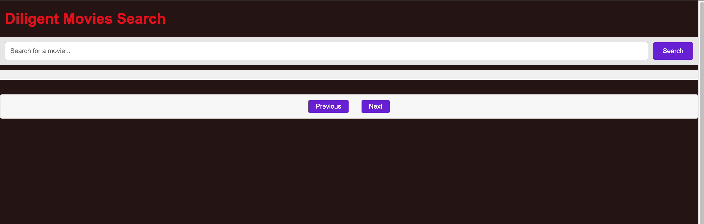
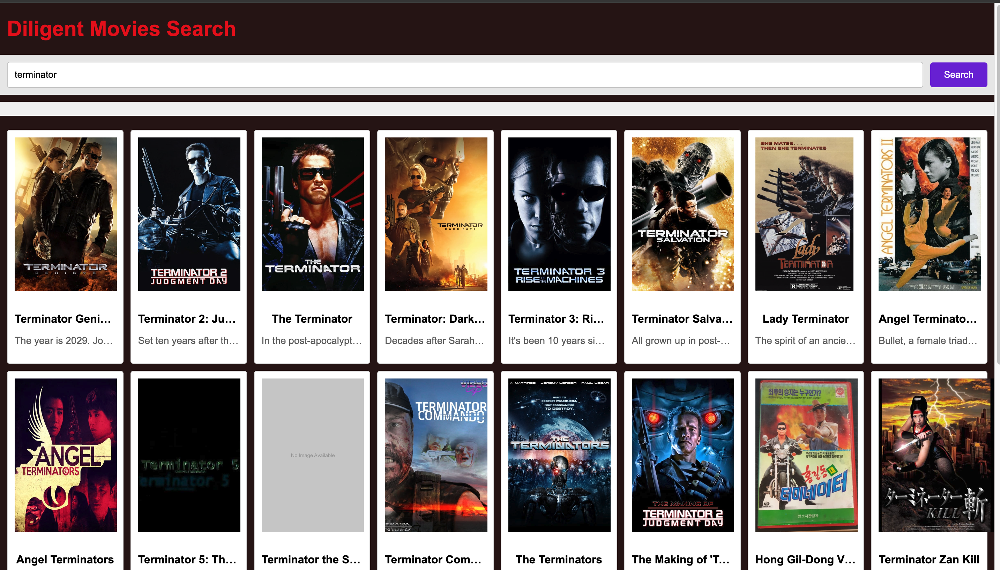

## Movie Search Application
Overview
The Movie Search Application is a web-based tool allowing users to search for movies using The Movie Database (TMDb) API. It features a simple, intuitive interface for users to enter search queries and view results. The backend, built with Ruby and Sinatra, communicates with TMDb API, caches results, and handles errors efficiently. The frontend, built with HTML, CSS, and JavaScript, presents a user-friendly interface and manages user interactions.

### Features
- Search for movies using keywords.
- View results in a paginated format.
- Backend caching to optimize API usage.
- Error handling for robustness.

### Live Version
- Click [here](https://movies-search-app-c2b68843fa14.herokuapp.com) for demo deployed version on Heroku

### Local version Image Demo




### Project Structure
- To be implemented after refactoring currently undergoing development and yet to refactored and modularized
- You track project Kanban plan [here](https://github.com/users/DanSam5K/projects/12/views/1)
- Interested in detail structure of the project you can find it here on this [issue](https://github.com/DanSam5K/movies-search-app/issues/17)

***Note : The above structure may be adjusted as this was an initial plan designed structure added for guidance can modified to suit project needs as seen***

### Getting Started
### Prerequisites
- Ruby (version 2.7 or higher)
- Sinatra Gem
- HTTParty Gem
- Redis (for caching, optional)
- Node.js and npm (for running the frontend) and other linters checkers
- Git 

### Clone the Repository
To get started with the Movie Search Application, clone the stable branch of the repository to your local machine:
the ```development``` branch is the stable branch recently.

### bash
- ```git clone https://github.com/DanSam5K/movies-search-app.git```
- navigate to the  project repo
    ~$ cd movie-search-app
- Install required Ruby gems:
    ~$ bundle install
- Set up environment variables:
Visit [TMDb](https://www.themoviedb.org/) to get an API key.
  Create a .env file or export environment variables:
  ```export MOVIE_API_KEY='your_tmdb_api_key'```

- Install them using npm:
  ~$ npm install
### Running the Application
- Start the backend server:
cd to the project root folder
  - ~$ ruby app.rb

This will start the Sinatra server.

Open a web browser and go to http://localhost:4567 to access the application.

### Testing
#### To run tests, navigate to the root directory and use RSpec:
- ~$ rspec
#### To Test for linters in local directory
- run the following
- ~$ run ``rubocop`` or ``rubocop -A`` - This command checks or fix ruby code style errors
- ~$ run ``npx hint .`` or ``npx hint . --fix`` to check or fix error that may occur with HTML respectively
- `$ run ``run: npx stylelint "**/*.{css,scss}"`` or ``run: npx stylelint "**/*.{css,scss}" --fix``  checks or fix css style code errors
- run: ``npx eslint . `` or ``npx eslint . --fix`` to check or fix javascript code error

### Author 🧑‍💻
- [Daniel Samuel](https://dansam5k.github.io/My-Portfolio/)
- [LinkedIn Profile](https://www.linkedin.com/in/dansamuel/)

### Additional features to be implemented
- For frontend testing,
- Convert and build a scalable version with RoR
- use react for front

### Issues

- Feel free to submit here [issues](https://github.com/DanSam5K/movies-search-app/issues) and enhancement requests.

### Acknowledgements
- Diligent Team

### Show your support
Give a ⭐️ if you like this project!

### 📝 License
This project is [MIT](./LICENSE) licensed.


